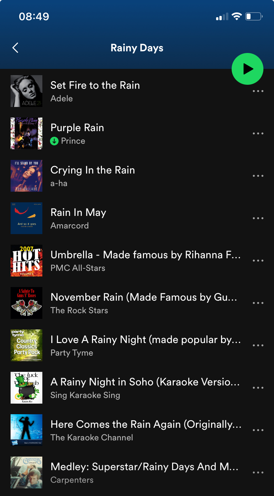

# Spotify Playlist Generator

Music Playlist Generator, using the OpenAI API and the Spotify API. A single line of command generates a playlist on the connected Spotify account.


Example command: `python app.py -p "Rainy Days" -n 10 -m "gpt-4o"`

Arguments:

* `-p` - Prompt for the OpenAI LLM to create a playlist. Used as the name of the playlist as well.
* `-n` (optional) - Number of songs to be listed. Default number: 8
* `-m` (optional) - Name of the Large Language Model. Default is `gpt-3.5-turbo`.





## How to run this project?


0. Prerequisites: 

    - Make sure Python3 is installed.
    - If you don't have an account with OpenAI, create one here: https://openai.com/
    - Create a project API key under Dashboard / API keys
    - Create a Spotify Developer Account here: https://developer.spotify.com

1. Clone the project.

2. Create a virtual environment inside the project folder:

    `python -m venv venv`

3. Activate the virtual environment:


    Mac: `source venv/bin/activate`


    Windows: `venv\Scripts\activate`


4. Create an `.env` file in the root folder and add your project's API key:

    ```
    OPENAI_API_KEY=your-unique-opanai-project-key
    SPOTIFY_CLIENT_ID=your-unique-client-ID
    SPOTIFY_CLIENT_SECRET=your-unique-client-secret
    ```


5. Install the python dependencies:

    `pip install -r requirements.txt`


6. Run the project in the console:

    - `python app.py -p "Happy days"` - "Happy days" will be the prompt for OpenAI to generate the playlist and it will be the title of the playlist on Spotify also.

    - `python app.py -p "Happy days" -n 10 -m "gpt-4o"` - The playlist is generated with the "gpt-4o" model and will consist of 10 sound tracks.

    - Command line arguments:
        * `-p` - Prompt for the OpenAI LLM to create a playlist. Used as the name of the playlist as well.
        * `-n` (optional) - Number of songs to be listed. Default number: 8
        * `-m` (optional) - Name of the Large Language Model. Default is `gpt-3.5-turbo`.


## Credits

This project was adopted from Colt Steele's Walkthrough project on Udemy: [Mastering OpenAI Python APIs](https://www.udemy.com/course/mastering-openai/?couponCode=24T3MT53024).

Changes made: API calls have been updated as per the latest documentation.
